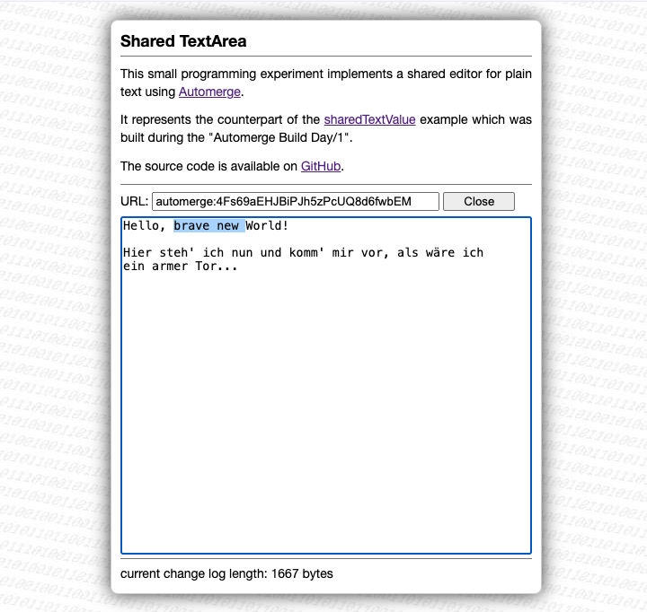

# sharedTextArea #

a small programming experiment implementing a shared plain text editor based on Automerge
([live demo](https://rozek.de/automerge/sharedTextArea.html))

This experiment is the counterpart of the [sharedTextValue](https://github.com/rozek/sharedTextValue) example which was built during the "Automerge Build Day/1".

It takes care of the various steps needed to load automerge and either create a new or open an existing document.

Once ready, automerge is used to share all text editing operations between any clients - and some extra code lines try to guarantee that these clients do not interfere with each other while editing the same text (even selection ranges should be kept intact)

If you want to see a live demo, just navigate to [https://rozek.de/automerge/sharedTextValue.html](https://rozek.de/automerge/sharedTextArea.html). Open it twice in two browser windows and see how changes in one window affect the other one - and vice versa.

## License ##

[MIT License](LICENSE.md)
